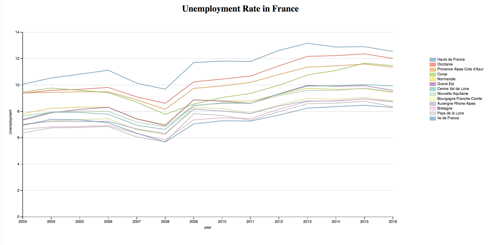
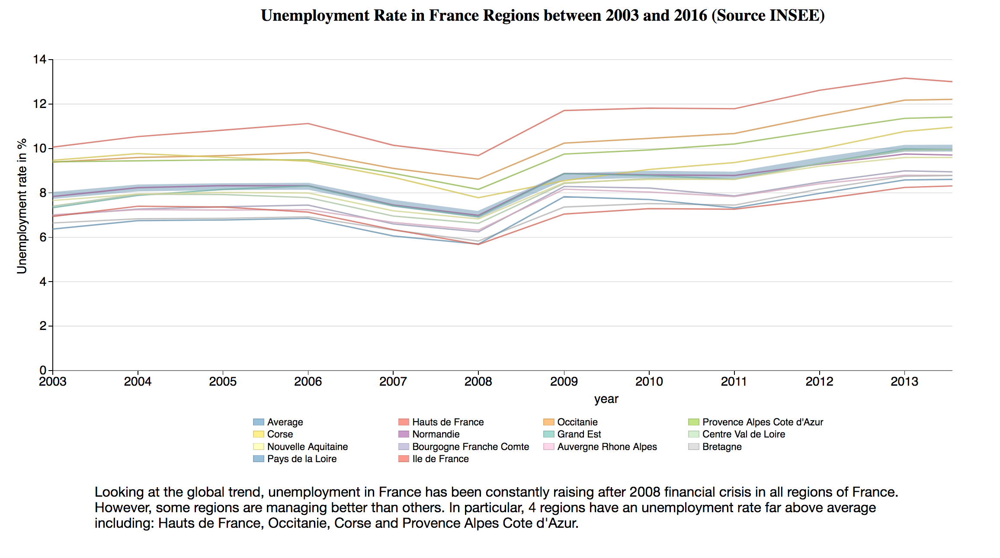
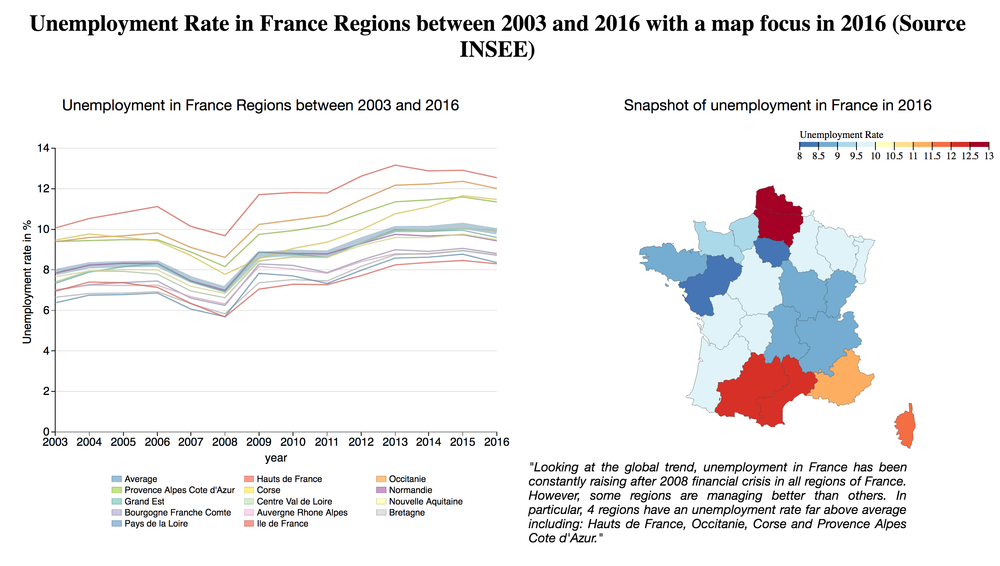

*** Data Visualization Project ***
*********************

Unemployment in France Regions
==

## Summary #

I decided to work on a quite simple dataset which is the evolution of unemployment in France between 2003 and 2016. The goal is to show the comparative evolution of unemployment in the various regions and that the trends are the same despite significant variation across regions. After having received all the feedback, I decided to go for a line chart plus a choropleth.

## Design#
### Data
The data I chose for that is coming from the French national institute of statistics and economical studies called INSEE (Institut National de Statistique et des Etudes Economiques - https://www.insee.fr/). The tsv file I compiled based on INSEE statistics is a three column tsv containing: Region, Year and Unemployment rate:

| Region      |     Year    |   Unemployment_rate |
| ------------- |: -------------: | ---------: |
| Auvergne Rhone Alpes      |        2016        |      8.73714285714286 |
| Bourgogne Franche Comte       |        2016       |      8.80434782608696 |
| Occitanie     |        2016        |      12.0116666666667 |
|Nouvelle Aquitaine|2016|9.48870967741935|
|...|...|...|

Later on, when introducing the choropleth chart, I'm using the same data limited to the year 2016.

### Initial Idea (index_1.html)

My initial idea is to build is simple linechart with several series for each region of France to be able to compare trands for each regions. Line chart seems to be appropriate because it enables to see well patterns over the time, here below is the first version of my visualization. I went for an author driven scenario with limited interactivity on the line chart (values are displayed when hovering mouse on the lines).



I asked a first feedback about that version. It seems that the overall message that the . Some of the comments mentionned that it was difficult to know how each regions were performing compared to the average. Further to that I decided to ass an Average line to show the average value for France. I also improved the general look of the visualization like the font-size, legends but also I added the source of the data as the feedback was mentionned. (see feedback section)

### Second version (index_2.html)

After taking into account the various feedback I received, I produced this new version of the HTML that improves the following features: font size, the lengend, added an average line, adding a description text :



### Third and final versions

Due to the feedback number 2 (are situation similar between close regions), I decided to add a choropleth in order to show the regional distribution of unployment in 2016 (last data point). This is to underline that extreme north and south regions seems to have more difficulties than center of France. I decided to use a diverging color scale to emphasize positive and negative variations around the central values.



I placed the two graphs close to each other with a description of what is the main takeaway of the visualization. 

## Feedback
### Feedback 1 : Dominique

- **What do you notice in the visualization?**
    
    The rate of unemployed people in various regions of France is changing following the same trends. The only region that evolves slightly differently is Corsica. 
      
      
- **What questions do you have about the data?**
      
    Where is the data coming from? what is the definition of "unemployed" people? 
    

- **What relationship do you notice?**
    
    The general trend is the increasing of unemployment in France, there is a steep increase in 2009 which is likely due to subprime crisis.
    
    
- **What do you think is the main takeaway from this visualization?**

     The rate of unemployed people in various regions of France is changing following the same trends.
     
     
- **Is there something you don't understand in the graphic?**

    What is the difference between those regions where unemployment is low and those where unemployment is high? What is the situation of each regions with respect to the mean unemployment rate? 
    

### Feedback 2 : Julien

- **What do you notice in the visualization?**
    
     I notice that there is a global increase of unemployment rate in France. Especially, there is a steep increase everywhere between 2008 and 2009.
     
     
- **What questions do you have about the data?**
      
    Does the computation of unemployment takes into account the increase of region population in each regions?
    

- **What relationship do you notice?**
    
   There is a positive correlation between the time and the unemployment rate for every regions of France.
   
    
- **What do you think is the main takeaway from this visualization?**

    Main takeaway is that the unemployment has been growing over the time everywhere in France
    
     
- **Is there something you don't understand in the graphic?**

    Are there similar situations in regions that are quite close from each other (North / south - east / west)?
    
    

### Feedback 3 : Hélène

- **What do you notice in the visualization?**
    
     I notice that Paris region has the smallest unemployment rate in France. The regions of the north of France are where there is the highest rate of unemployement. I also notice that the unemployment rate is raising after 2008 crisis.
     
     
- **What questions do you have about the data?**
      
    I don't have specific questions about the data
    

- **What relationship do you notice?**
    
   I notice that there is a global increase of unemployment
   
    
- **What do you think is the main takeaway from this visualization?**

    The evolution trend of unemployment is the same in all France regions but there is large differences of absolute values (4% difference in 2016 between the highest rate and the lowest)
    
     
- **Is there something you don't understand in the graphic?**

    Everything is clear


## Resource#
- Mike Bostock visualization on french population https://bl.ocks.org/bricedev/97c53d6ed168902239f7
- Mike Bostock visualization of US unemployment https://bl.ocks.org/mbostock/4060606
- CSS formating help https://www.w3schools.com/
- Color brewer help http://colorbrewer2.org/#type=diverging&scheme=RdYlBu&n=11


```python

```
